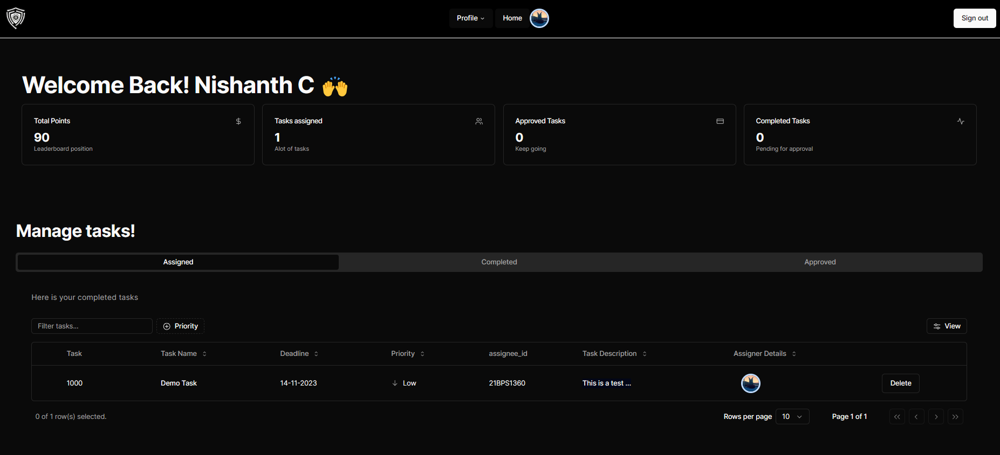
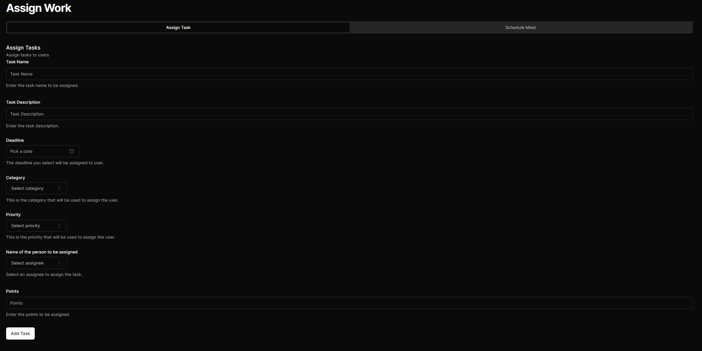
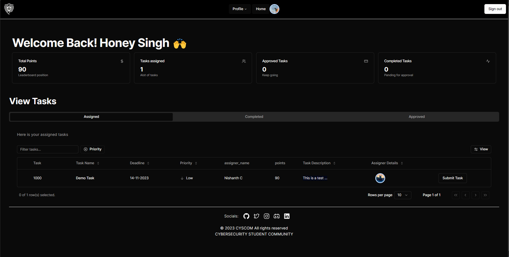
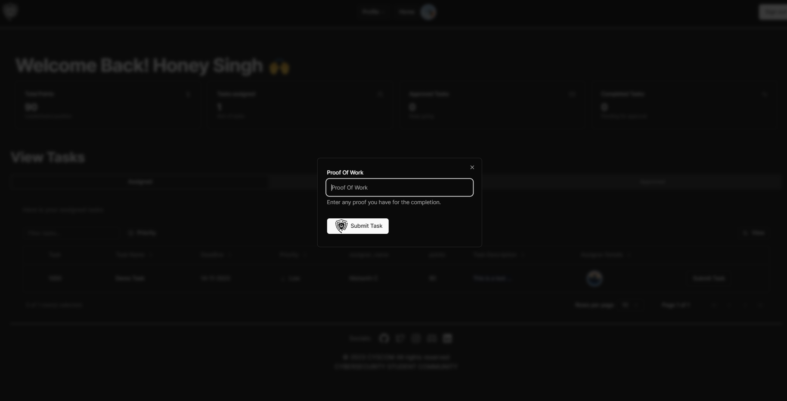
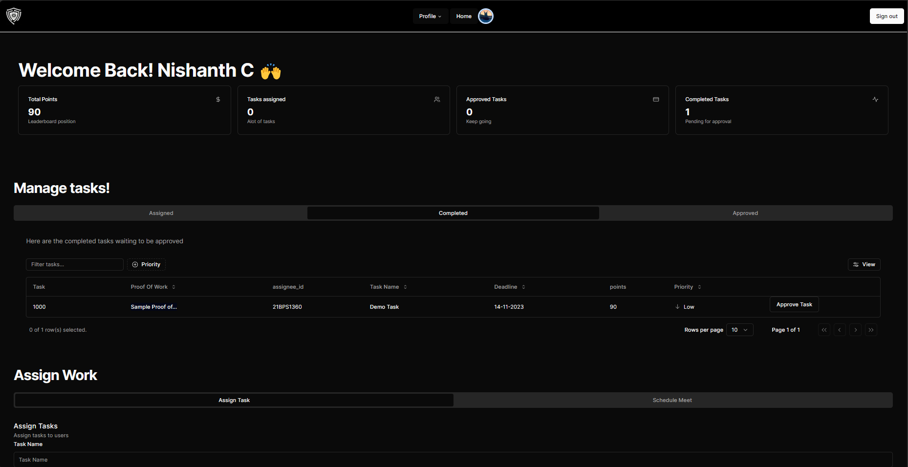
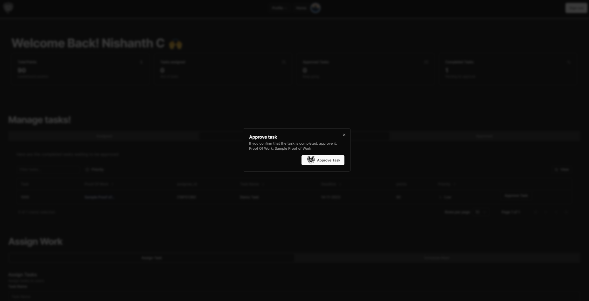
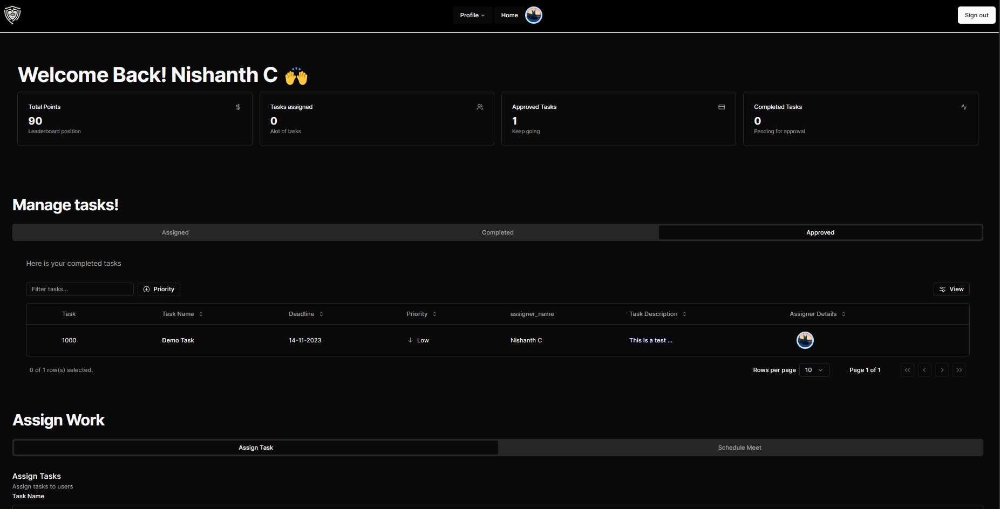

# Club Management App

This is a club management app built using Next.js, ShadCN-UI, Radix-UI, Tan-Stack, Next-Auth and MongoDB

## Roles
We are following a role based authentication.
There are three roles: **user, admin and core.**

**User** are the members of the club, who work under the cabinet.
**Admin** are the coleads/leads of the club, who work under the core.
**Core** are the super admins, they have access to most of the website.

A **core member, or an admin can assign task to user, and validate it upon completion**.


As you can see, there are 3 tables:
**assigned table** is for viewing the assigned tasks,
**completed table** is for viewing the completed tasks,
**approved table** is for viewing the approved tasks,
See the below example to know how it works.

## Example
### Admin:  
  

Say a cabinet member wants to assign a **task**
he/she will fill this form below  



After clicking submit, the task gets assigned to user, so in the **admin and user side 'assign table' gets populated**.  


### Now user side:  



### The user will see the task in **assign table** and clicks submit task
he/she will view a popover, which asks for **Proof of Work**, i.e., a proof that he/she has completed the task  



Upon submitting the task, the **admin and user side, the 'completed table' gets populated**
### Admin side:  



### So now the admin will click **approve task** , a popover will appear which displays the **Proof of Work** entered by the user, upon satisfaction the admin will approve the task  


### Now in the admin and user side, the **approved table** gets populated.  


# To run the app
## Create a .env file with

```
GOOGLE_CLIENT_ID=
GOOGLE_CLIENT_SECRET=
NEXTAUTH_URL=http://localhost:3000
NEXTAUTH_SECRET=secret
MONGODB_URI=
```

## Then clone and run the repo


```
git clone https://github.com/cyscomvit/ClubHub-Pro/
npm install
npm run dev
```
Thats the end!


